# Architecture — what has been built

See `method-spec.md` for the full method spec this implements, and `ch-proposed.tex`
(thesis Ch. 10) for the declared source of truth.

```mermaid
classDiagram
    direction TB

    namespace Environment_utils {
        class Scenario {
            +Map map
            +PhysicsTask task
            +float rescue_range = 0.5
            +float rescue_reward = 10
            +float decay_penalty = 0.1
            +float shaping_weight
            +float collision_penalty
            +bool randomize_map
            +list~Survival~ _survivals
            +make_world(batch, device)
            +reset_world_at(env_index)
            +observation(agent)
            +reward(agent)
            +post_step()
            +done()
        }
        class Map {
            +float width
            +float height
            +list obstacles
            +list agents
            +list survivals
            +Tensor cells_bitmap
            +read_map_from_file(path)
            +make_random_map(...)
            +reshuffle_positions(max_tries)
            +reset_agents()
            +get_free_cell(entity)
            +save_to_yaml(path)
        }
        class MapEntityInfo {
            +Tensor position
            +Shape shape
            +float radius_or_weight
        }
        class Survival {
            +Tensor health
            +Tensor rescued
            +float initial_health = 100
            +float decay_rate = 0.2
            +render(env_index)
        }
        class Ear {
            +list~Survival~ _survivals
            +float _ear_offset
            +float _rescued_value
            +measure()
        }
        class PhysicsTaskSampler {
            +UniformRange drag
            +UniformRange linear_friction
            +UniformRange agent_mass
            +sample()
            +sample_batch(n)
        }
        class PhysicsTask {
            +float drag
            +float linear_friction
            +float angular_friction
            +float agent_mass
        }
    }

    namespace DrIGM_Baseline_utils {
        class RescueTaskClass {
            +get_env_fun()
        }
        class RobustQmix {
            +float rho
            +_get_loss(...)
        }
        class RobustVdn {
            +float rho
            +_get_loss(...)
        }
    }

    namespace Encoders_method {
        class ConditionalFlow {
            +ModuleList layers
            +forward(y, cond)
            +inverse(z, cond)
        }
        class ConditionalAffineCoupling {
            +_ConditionerMLP conditioner
            +bool flip
            +forward(y, cond)
        }
        class ExchangeablePosterior {
            +int code_dim
            +float nu
            +float kappa
            +init_state(shape)
            +step(state, code)
            +step_where(state, code, mask)
            +reset_where(state, mask)
        }
        class PosteriorState {
            +Tensor mu
            +Tensor sigma2
            +Tensor count
        }
        class BudgetEncoder {
            +forward(x_exe)
            +sample(mu, sigma2)
        }
        class BudgetDecoder {
            +forward(rho)
        }
    }

    namespace Policies_method {
        class GaussianPolicy {
            +Sequential net
            +Linear mu_head
            +Linear log_std_head
            +float action_scale
            +forward(x)
            +sample(x)
        }
        class ExplorationPolicy {
            +act(obs)
        }
        class ExecutionPolicy {
            +act(obs, belief)
        }
    }

    namespace Critics_method {
        class TwinQNetwork {
            +QNetwork q1
            +QNetwork q2
            +forward(x)
            +min_q(x)
        }
        class ExplorationCritic {
            +q(obs, action)
        }
        class ExecutionCritic {
            +q(obs, action, belief_flat)
        }
        class QMixer {
            +int n_agents
            +int embed_dim
            +Linear hyper_w1
            +Linear hyper_w2
            +Linear hyper_b1
            +Linear hyper_b2
            +forward(q_values, state)
        }
    }

    namespace Detector_method {
        class CausalLocalWindowTransformer {
            +int window
            +Linear input_proj
            +TransformerEncoder transformer
            +Linear head
            +feat_mean
            +feat_var
            +feat_count
            +forward(codes)
            +update_norm(x)
        }
    }

    namespace Adversary_Disentangle_method {
        class perturb_position
        class perturb_own_action
        class maal_perturb
        class cross_covariance_penalty
    }

    namespace Regime_method {
        class Regime {
            +float mass
            +float linear_friction
        }
        class EpisodeRegimeSchedule {
            +list~Regime~ mu_1
            +list~Regime~ mu_2
            +Tensor switch_time
            +Tensor mode_1
            +Tensor mode_2
        }
    }

    namespace Buffers_method {
        class ReplayBuffer {
            +int capacity
            +dict _storage
            +int _size
            +add(**fields)
            +sample(batch_size, device)
            +is_ready(n)
        }
    }

    namespace Training_method {
        class Phase1Config {
            +int n_envs, horizon, batch_size
            +float lr, gamma, nu, kappa
            +int code_dim, rho_dim
            +float lambda_cpc, lambda_cov
            +tuple mass_range, friction_range
            +float p_sw, eps_a_range
            +float eps_pos, eps_self_action
        }
        class Phase1Trainer {
            +Environment env
            +ConditionalFlow flow
            +ConditionalFlow flow_momentum
            +ExchangeablePosterior posterior
            +BudgetEncoder budget_encoder
            +BudgetDecoder budget_decoder
            +ModuleList exploration_policies
            +ModuleList execution_policies
            +ModuleList exploration_critics
            +ModuleList execution_critics
            +QMixer mixer
            +Parameter cpc_w
            +Parameter log_alpha_exp
            +Parameter log_alpha_exe
            +ReplayBuffer d_exp
            +ReplayBuffer d_exe
            +rollout_iteration()
            +update()
            +_update_representation()
            +_update_exploration()
            +_update_execution()
            +_polyak_update()
        }
        class Phase2Config {
            +int d_model, n_heads, n_layers, window
            +str detector_input
            +str detector_loss = "paper"
            +int label_half_width
            +float label_smooth_eps
            +float near_boundary_alpha
            +int len_segment
        }
        class Phase2Trainer {
            +Phase1Trainer phase1
            +Phase2Config cfg
            +CausalLocalWindowTransformer detector
            +Adam optimizer
            +collect_labeled_episode()
            +train_iteration()
        }
    }

    namespace MetaTest_method {
        class MetaTestConfig {
            +float threshold_C = 0.6
            +int trigger_persistence = 3
            +int re_exploration_budget_K
            +float sigma2_min
            +float eps_pos, eps_action
        }
        class StepResult {
            +int step
            +list rewards
            +list mode
            +list detector_p
            +list reset_fired
            +list active_attacks
        }
        class MetaTestRunner {
            +Phase1Trainer p1
            +CausalLocalWindowTransformer detector
            +MetaTestConfig cfg
            +Environment env
            +PosteriorState posterior_state
            +list mode
            +list k
            +list p_streak
            +list code_history
            +schedule(events)
            +reset_state()
            +step(render)
        }
    }

    %% -- relationships: must live outside namespace blocks --
    Scenario "1" *-- "many" Survival
    Scenario "1" o-- "N" Ear : per-agent sensor
    Scenario --> Map
    Scenario ..> PhysicsTask : optional
    Map "1" *-- "many" MapEntityInfo
    Ear ..> Survival : reads pos
    PhysicsTaskSampler ..> PhysicsTask : creates

    RescueTaskClass --> Scenario : builds
    RobustQmix ..> RescueTaskClass
    RobustVdn ..> RescueTaskClass

    ConditionalFlow "1" *-- "n_layers" ConditionalAffineCoupling
    ExchangeablePosterior ..> PosteriorState : creates / updates
    ConditionalFlow ..> ExchangeablePosterior : codes c_i,t feed

    ExplorationPolicy --|> GaussianPolicy
    ExecutionPolicy --|> GaussianPolicy
    ExplorationCritic --|> TwinQNetwork
    ExecutionCritic --|> TwinQNetwork
    ExecutionCritic ..> QMixer : mixed to Q_tot

    EpisodeRegimeSchedule "1" *-- "2N" Regime

    Phase1Trainer ..> Phase1Config
    Phase1Trainer o-- "2" ConditionalFlow : flow, flow_momentum
    Phase1Trainer o-- ExchangeablePosterior
    Phase1Trainer o-- BudgetEncoder
    Phase1Trainer o-- BudgetDecoder
    Phase1Trainer o-- "N" ExplorationPolicy
    Phase1Trainer o-- "N" ExecutionPolicy
    Phase1Trainer o-- "N" ExplorationCritic
    Phase1Trainer o-- "N" ExecutionCritic
    Phase1Trainer o-- QMixer
    Phase1Trainer o-- "2" ReplayBuffer : D_exp, D_exe
    Phase1Trainer --> Scenario : via factory
    Phase1Trainer --> EpisodeRegimeSchedule : per iteration
    Phase1Trainer ..> perturb_position
    Phase1Trainer ..> perturb_own_action
    Phase1Trainer ..> cross_covariance_penalty

    Phase2Trainer ..> Phase2Config
    Phase2Trainer o-- Phase1Trainer : freezes everything
    Phase2Trainer *-- CausalLocalWindowTransformer

    MetaTestRunner ..> MetaTestConfig
    MetaTestRunner o-- Phase1Trainer : frozen f_phi + policies
    MetaTestRunner *-- CausalLocalWindowTransformer
    MetaTestRunner --> Scenario : own single-env instance
    MetaTestRunner ..> StepResult : yields per step
    MetaTestRunner ..> Regime : RegimeChangeEvent

    %% -- notes --
    note for PhysicsTaskSampler "drag / friction / mass sampler — built and tested, NOT wired into any training run"
    note for maal_perturb "method/adversary/maal.py — implemented but NOT used by Phase1Trainer"
    note for perturb_position "PGD on agent-0 perceived position, used in the execution-critic target and meta-test"
    note for perturb_own_action "PGD on agent-0 own action, chained after the position attack"
    note for QMixer "IGM-monotonic (abs() hypernet weights); state = concat of every agent's obs"
    note for ExchangeablePosterior "BRUNO conjugate recursion; sigma2 only shrinks (q=0). Random-walk / process-noise variant is spec-only, not implemented"
    note for CausalLocalWindowTransformer "h_xi. Built via Phase2Config: 4 layers, d_model 64, window 20. Trained with paper_cpd_loss (arXiv:2510.24988 boundary BCE); detection_loss (InDiD delay/FA) kept as detector_loss='indid'"
    note for Phase1Trainer "context + exploration + execution trained jointly; replay minibatch moved to trainer device on sample()"
    note for Phase2Trainer "supervised detector training on frozen f_phi embeddings (or raw (o,a,r,o'))"
    note for MetaTestRunner "reset fires after p >= threshold_C for trigger_persistence steps -> posterior reset + bounded re-exploration"
    note for ReplayBuffer "flat ring buffer, joint per-timestep rows; CPU storage, per-minibatch device move"
```

**Reading it.** Solid arrows / inheritance = built and wired together; dotted `..>` =
"depends on / feeds into". The `Environment_utils` and `DrIGM_Baseline_utils` blocks are
the working VMAS Search-and-Rescue scenario plus the ρ-contamination robust QMIX/VDN
baseline. Everything else is the `method/` package implementing the Two-Phase
Exchangeable-Context CCM–FMASAC method:

- **Phase 1** (`Phase1Trainer`) — jointly trains the context flow `f_phi` + momentum copy,
  the BRUNO posterior, the budget encoder/decoder, and per-agent SAC exploration and
  execution policies/critics with the QMIX mixer. Built and runs.
- **Phase 2** (`Phase2Trainer` + `CausalLocalWindowTransformer`) — freezes Phase 1 and
  supervises the change-point detector `h_xi` with the boundary-BCE objective of
  arXiv:2510.24988 (InDiD's delay/false-alarm loss is retained as an alternative). Built.
- **Meta-test** (`MetaTestRunner`) — frozen deployment loop: per-step detector probability,
  persistence-filtered reset of the context posterior, bounded re-exploration, optional
  PGD attack on one agent. Built.

Helpers not shown as classes: `method/io.py` (`load_phase1`, `load_detector`, `load_model`,
`resolve_device`), `method/metrics.py` (`detection_metrics`, `recovery_time`, `degradation`,
`bootstrap_ci`, `iqm`), `method/belief.py` (`flatten_belief`), `method/encoders/encoder_losses.py`
(`elbo_loss`, `infonce_cpc_loss`). Evaluation entry points: `scripts/recovery_eval.py`
(detector TP/TN/F1/delay + recovery time, reset vs. passive) and
`test_environment_report.ipynb`.

Specified in the thesis but **not implemented**: the within-episode random-walk drift and the
process-noise BRUNO recursion (`ch-proposed.tex` Eq. pm-drift / pm-bruno-drift); an
adaptive-MARL baseline on the shared task.
