# Architecture — what has been built

See `method-spec.md` for the full method spec this implements.

```mermaid
classDiagram
    direction TB

    namespace Environment {
        class Map {
            +agents : list~AgentInfo~
            +obstacles : list~ObstacleInfo~
            +survivals : list~VictimInfo~
            +make_random_map()
            +read_map_from_file(path)
            +save_to_yaml(path)
            +get_free_cell(entity)
        }
        class Scenario {
            +map : Map
            +task : PhysicsTask
            +rescue_range : float
            +rescue_reward : float
            +lidar_n_rays : int
            +lidar_range : float
            +make_world(batch_dim, device)
            +observation(agent)
            +reward(agent)
            +post_step()
            +done()
        }
        class Survival {
            +required_rescuers : int
            +health : Tensor
            +rescued : Tensor
            +decay_rate : float
        }
        class Ear {
            +measure()
        }
        class Lidar {
            +measure()
        }
        class PhysicsTaskSampler {
            +sample()
        }
    }

    namespace DrIGM_Baseline {
        class RescueTaskClass {
            +get_env_fun()
        }
        class RobustQmix {
            +rho : float
        }
        class RobustVdn {
            +rho : float
        }
    }

    namespace Encoders {
        class ExchangeablePosterior {
            +nu : float
            +kappa : float
            +init_state(shape)
            +step(state, code)
            +reset_where(state, mask)
        }
        class PosteriorState {
            +mu : Tensor
            +sigma2 : Tensor
            +count : Tensor
        }
        class ConditionalFlow {
            +forward(y, cond)
            +inverse(code, cond)
        }
        class BudgetEncoder {
            +forward(x_exe)
        }
        class BudgetDecoder {
            +forward(rho)
        }
    }

    namespace Policies {
        class GaussianPolicy {
            +sample(x)
        }
        class ExplorationPolicy
        class ExecutionPolicy
    }

    namespace Critics {
        class TwinQNetwork {
            +q1
            +q2
            +min_q(x)
        }
        class ExplorationCritic
        class ExecutionCritic
        class QMixer {
            +forward(q_values, state)
        }
    }

    namespace Adversary_Disentangle {
        class maal_perturb
        class cross_covariance_penalty
    }

    namespace Buffers_Training {
        class ReplayBuffer {
            +add()
            +sample(batch_size)
        }
        class EpisodeRegimeSchedule {
            +mu_1 : list~Regime~
            +mu_2 : list~Regime~
            +switch_time : Tensor
        }
        class Phase1Trainer {
            +rollout_iteration()
            +update()
        }
    }

    namespace Not_Built_Yet {
        class InDiDDetector
        class MetaTest
    }

    %% -- relationships: must live outside namespace blocks --
    Scenario "1" *-- "many" Survival
    Scenario "1" o-- "2" Ear : agent sensor
    Scenario "1" o-- "1" Lidar : agent sensor
    Scenario --> Map
    Scenario ..> PhysicsTaskSampler : optional task

    RescueTaskClass --> Scenario : builds
    RobustQmix ..> RescueTaskClass
    RobustVdn ..> RescueTaskClass

    ExchangeablePosterior --> PosteriorState
    ConditionalFlow ..> ExchangeablePosterior : produces codes for

    ExplorationPolicy --|> GaussianPolicy
    ExecutionPolicy --|> GaussianPolicy

    ExplorationCritic --|> TwinQNetwork
    ExecutionCritic --|> TwinQNetwork
    ExecutionCritic ..> QMixer : mixed into Q_tot

    Phase1Trainer o-- "2" ReplayBuffer : D_exp, D_exe
    Phase1Trainer --> EpisodeRegimeSchedule : samples per iteration
    Phase1Trainer --> ConditionalFlow
    Phase1Trainer --> ExchangeablePosterior
    Phase1Trainer --> BudgetEncoder
    Phase1Trainer --> BudgetDecoder
    Phase1Trainer --> ExplorationPolicy
    Phase1Trainer --> ExecutionPolicy
    Phase1Trainer --> ExplorationCritic
    Phase1Trainer --> ExecutionCritic
    Phase1Trainer --> maal_perturb
    Phase1Trainer --> cross_covariance_penalty

    Phase1Trainer ..> InDiDDetector : Phase 2, not started
    InDiDDetector ..> MetaTest : feeds

    %% -- notes --
    note for PhysicsTaskSampler "drag, friction, mass - built, not yet wired into a training run"
    note for RobustQmix "TD0 discount gamma becomes gamma*(1-rho)"
    note for RobustVdn "same rho-contamination trick as RobustQmix"
    note for ExplorationPolicy "pi_explore_i(a|o) - not belief-conditioned"
    note for ExecutionPolicy "pi_execute_i(a|o,b_i) - belief-conditioned"
    note for ExplorationCritic "Q_exp_i - no mixer, invariant 1"
    note for ExecutionCritic "Q_exe_i - belief-conditioned, feeds Q_tot"
    note for QMixer "g_omega, IGM-monotonic: dQtot/dQi >= 0, verified"
    note for maal_perturb "one-step projected-gradient teammate perturbation, eps_a ball"
    note for cross_covariance_penalty "L_cov: penalizes linear mu_z / mu_rho leakage"
    note for ReplayBuffer "ring buffer, joint per-timestep rows"
    note for Phase1Trainer "verified: 25+ iterations, no NaNs, l_elbo decreasing 594 to 206"
    note for InDiDDetector "Phase 2: transformer h_xi, causal+local-window mask, trained on frozen f_phi"
    note for MetaTest "change-point-triggered re-exploration loop"
```

**Reading it:** solid arrows/inheritance = built and wired together; dotted `..>` = "depends on / feeds into" or "planned, not built." The `Environment` and `DrIGM_Baseline` blocks are the fully working VMAS search-and-rescue scenario plus the ρ-contamination robust QMIX/VDN baseline. Everything else is the `method/` package for the thesis's novel Two-Phase Exchangeable-Context CCM–FMASAC method — Phase 1 (`Phase1Trainer`) is built and verified to run/train; `InDiDDetector` (Phase 2) and the meta-test loop are the two pieces still outstanding.
